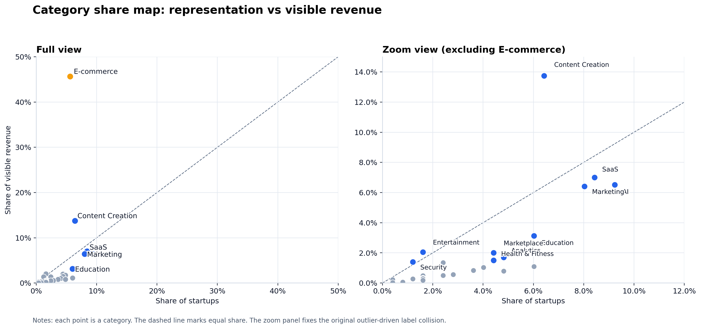
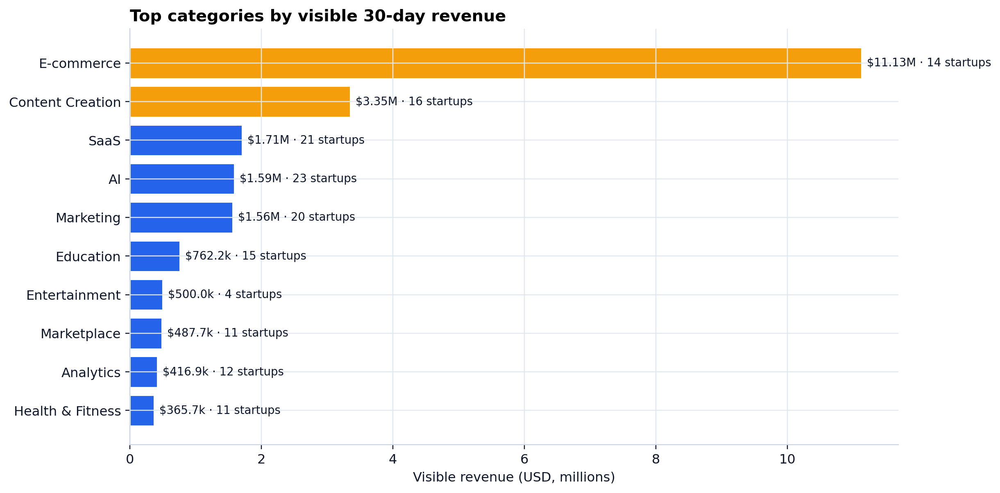
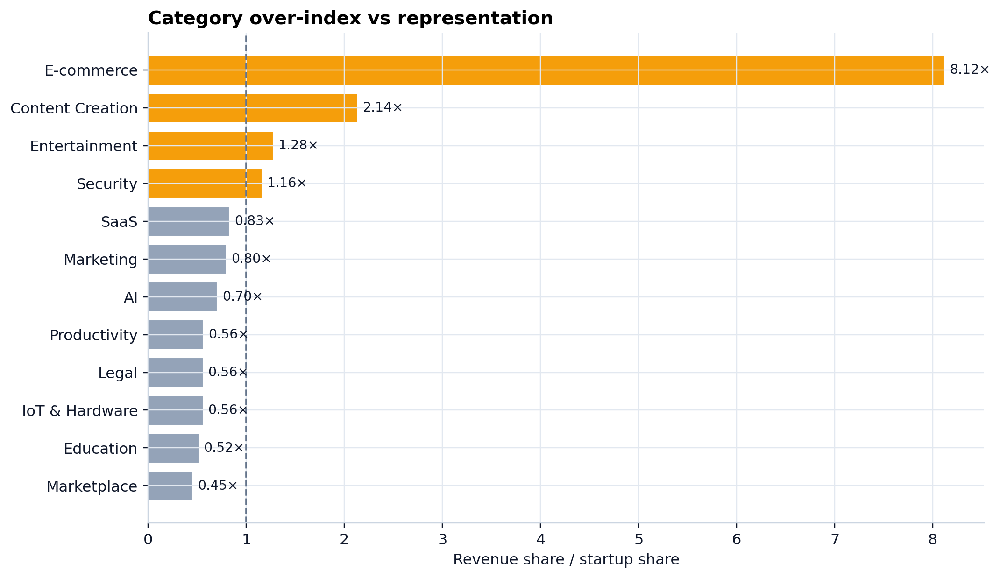
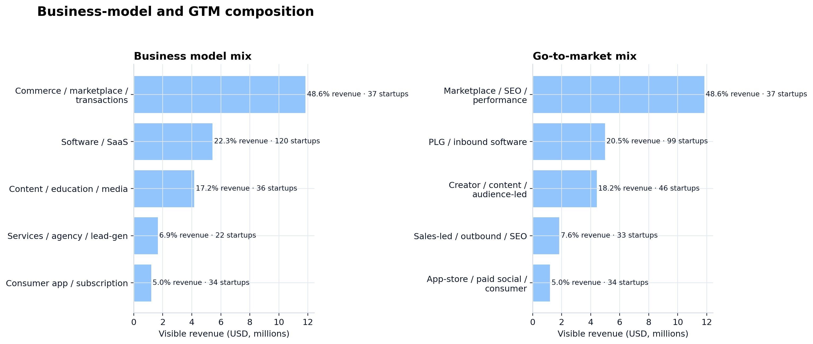
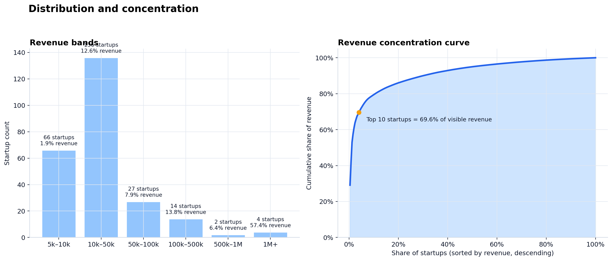

# TrustMRR visible-sample research

Independent, GitHub-ready packaging of a **visible public sample** of startups with `Revenue (30d) >= $5,000`.

## What is in scope

- Startup-level visible sample
- Category, business-model, GTM, and revenue-band summaries
- Validation, source-coverage, and pipeline-manifest JSON reports
- Publication-grade charts in both PNG and SVG
- Reproducible build script
- Methodology, data notes, and release checklist

## Key takeaways

- Visible sample size: **229 startups**
- Total visible 30-day revenue: **$24.30M**
- Median visible 30-day revenue: **$19.0k**
- Top 10 startups capture **70.4%** of visible revenue
- The largest category is **E-commerce**, accounting for **45.8%** of visible revenue with **5.2%** of visible startups

## Main charts

### Category share map


### Top categories by visible revenue


### Category over-index vs representation


### Business-model and GTM composition


### Distribution and concentration


## Repository layout

```text
.
├── .github/
│   └── workflows/
│       ├── build.yml
│       └── pages.yml
├── charts/
├── data/
├── docs/
│   └── methodology.md
├── tests/
│   ├── test_build_artifacts.py
│   ├── test_build_site.py
│   ├── test_fetch.py
│   ├── test_phase2_pipeline.py
│   ├── test_publication_docs.py
│   ├── test_promote_live_bundle.py
│   └── test_workflows.py
├── pyproject.toml
├── src/
│   ├── build_site.py
│   ├── config.py
│   ├── fetch.py
│   ├── promote_live_bundle.py
│   ├── site_builder.py
│   ├── build_artifacts.py
│   └── fancymmr_build/
│       ├── aggregate.py
│       ├── charts.py
│       ├── config.py
│       ├── publication.py
│       ├── readme_builder.py
│       ├── schemas.py
│       └── validation.py
├── CHANGELOG.md
├── DATA-NOTICE.md
├── LICENSE-CODE-MIT.txt
├── RELEASE_CHECKLIST.md
└── requirements.txt
```

## Method note

This repository is based on a **source-derived visible sample**, not a full platform export. The `biz_model` and `gtm_model` fields are heuristic labels. See [docs/methodology.md](docs/methodology.md) for details, and inspect `data/validation_report.json` plus `data/source_coverage_report.json` for the current bundle checks.

## Pipeline status

- `data/publication_input.json` is the publication-source contract; it currently points at `data/visible_sample.csv` as the active published dataset
- `python src/build_all.py --limit 1` is the staged live-source smoke path; it writes repo-local outputs under `data/source_pipeline/` without mutating the published bundle yet
- `python src/promote_live_bundle.py` projects `data/source_pipeline/processed/visible_sample_rows.csv` into `data/promoted_visible_sample.csv` and updates `data/publication_input.json` only after the staged validation is `passed`, unmapped visible rows are `0`, suspicious duplicate groups are `0`, and the staged run covers every source in `data/public_source_pages.csv`
- The repo still publishes the checked-in seed bundle by default until the promotion command is run deliberately after a full staged source-registry pass.

## Rebuild

```bash
python -m venv .venv
source .venv/bin/activate
pip install -r requirements.txt
python src/build_artifacts.py
python src/build_site.py
```

## Verify

```bash
python -m pytest
```

## Source-pipeline smoke

```bash
python src/build_all.py --limit 1
```

## Promote staged live bundle

```bash
python src/promote_live_bundle.py --dry-run
python src/promote_live_bundle.py
python src/build_artifacts.py
python src/build_site.py
```

`python src/build_all.py --limit 1` is only a smoke run. Promotion should wait for a full staged pass across the current registry in `data/public_source_pages.csv`.

## CI and Pages

Local CI-equivalent commands:

```bash
python -m pytest
python src/build_artifacts.py
python src/build_site.py
```

The GitHub-hosted workflows pin Python 3.12, install the repo dependencies, and run the same rebuild commands before deploying Pages.

GitHub Actions automation lives in:

- `.github/workflows/build.yml` for pull requests, manual runs, and pushes to `main`
- `.github/workflows/pages.yml` for static GitHub Pages deployment from the generated `site/` directory

To use the deployment workflow, set the repository Pages source to **GitHub Actions** once in the repository settings.

## Release flow

1. Run the local CI-equivalent commands and any targeted source-pipeline smoke you want in the release notes.
2. Confirm `.github/workflows/build.yml` and `.github/workflows/pages.yml` are green on `main`.
3. Update `CHANGELOG.md`, re-read `README.md`, and re-read `docs/methodology.md` plus `DATA-NOTICE.md`.
4. Use `RELEASE_CHECKLIST.md`, then draft the GitHub release from the tag you want to publish and review the generated notes before publishing.

## Licensing and publication notice

- `LICENSE-CODE-MIT.txt` covers the original code and original documentation in this repository
- `DATA-NOTICE.md` remains the publication notice for source-derived data plus generated CSV/JSON outputs, charts, and the static site bundle
- `CHANGELOG.md` tracks release-note-level changes and `RELEASE_CHECKLIST.md` is the pre-release gate
- This repo intentionally does **not** collapse those scopes into one top-level detected `LICENSE` file, because GitHub license detection expects a standard root license file and that would overstate the rights granted for the derived data bundle
